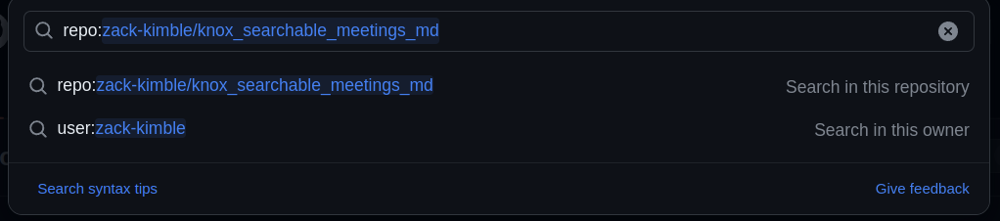

# Knox searchable meetings

## Overview

This repository allows users to conduct text search against videos of Knox County public meetings. It contains timestamped transcriptions of each meeting. Each timestamp also contains a link to the meeting video, allowing users to click through to that moment in the meeting's video.

## How to use

### Repository structure

Within the `meetings` directory, each meeting series has it's own directory. Each individual meeting has a markdown file with a transcription of the meeting. Larger meetings are split into multiple files so that they will still be indexed for search by Github.

The names for meeting series are based on the topics created by Knox Community TV when uploading the video to the Internet Archive. The file names for each meeting will match the video title on the Internet Archive.

### Transcription file

Each meeting is represented as a timestamped transcription with links to the video. If you navigate to a specific meeting (eg [meetings/City Council/City Council R 265 230307_0.md](https://github.com/zack-kimble/knox_searchable_meetings_md/blob/main/meetings/City%20Council/City%20Council%20R%20265%20230307_0.md)), you should see a table like below, if not click the "preview" button.

Simple ctrl-f can be done within the preview for a single meeting. Click on the link to go to exact moment in the video where the text segment was mentioned.

### Searching across meetings

This project takes advantage of Github's indexed search capabilities (Code Search). You can search for specific keywords or phrases using the native Github search bar in the top right of the page. Basic quoting, wildcards, boolean operators etc are supported, see [Github docs](https://docs.github.com/en/search-github/github-code-search/understanding-github-code-search-syntax).

----

The results page will show each individual file (ie meeting) and the first few hits within that file.

Note that when click on the file name from the search results it will probably show the raw markdown "code". Clicking the preview button on the top left will make things look nicer.

To search within a specific meeting series, just initiate the search from that folder. Or add `path:meetings/[name of meeting series]` to the search bar.

## Updates

Currently, my desktop will look for new videos every 24 hours and download and transcribe them, assuming it's on. I make no guarantees, but generally speaking, this will happen every weekday morning. Note that the video of the meeting has to be available on the Internet Archive. This does not always happen the day of the meeting.

I will also be slowly working my way back through historical meetings.

If there is interest and usage of the repository, I will take the time to have updates to start on a server within an hour of the video being available. Please star the repository if you find it useful.

## Code 

The code that generates transcriptions can be found at [searchable-public-meetings](https://github.com/zack-kimble/searchable-public-meetings).

Videos are pulled via api from the Internet Archive where they are kindly uploaded by Knox Community Media.

Transcription uses the [Faster Whisper](https://github.com/guillaumekln/faster-whisper) model.

## Issues, suggestions, and contributions

If you find bugs or have suggestions for format changes or additional meetings series to cover, please either open an issue here or email me at zkimble at gmail dot com. If there's enough interest and need, I'll look into building an actual site for this.

If you would like to contribute code, please open a pull request in the [searchable-public-meetings](https://github.com/zack-kimble/searchable-public-meetings) repository.

## Accuracy Disclaimer

These transcriptions are imperfect and are for search purposes only. I make no guarantees of their acccuracy. Any reference to words spoken within a transcribed meeting should be done using the original video and not the transcription. Do not quote the transcription.

## License

The transcriptions and their arrangement on this site are licensed under the  Creative Commons Attribution-ShareAlike 4.0 International license.